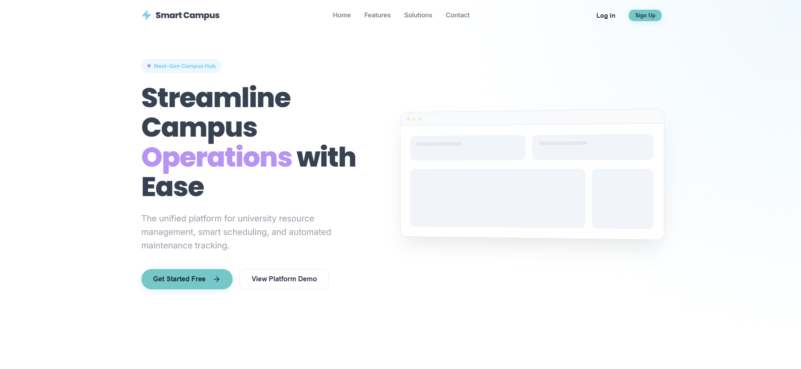

🚀 Smart Campus Operations Hub



A state-of-the-art, unified ecosystem designed to streamline campus operations, resource management, and communication for modern educational institutions.

----------------------------------------------------------------------------------------------------------------------------------------------------------------

📝 Project Description

The Smart Campus Operations Hub is a comprehensive management system built to enhance the efficiency of university campus life. It bridges the gap between students, administrators, and technical staff by providing a centralized platform for resource allocation, maintenance tracking, and real-time communication.
Built with a focus on Visual Excellence and User Experience, the system features a premium dashboard, real-time updates via WebSockets, and a robust security layer using JWT and Google OAuth2.

-----------------------------------------------------------------------------------------------------------------------------------------------------------------

✨ Key Features

🏢 Resource Management
- Full inventory tracking of campus assets (labs, equipment, rooms).
- Status monitoring (Active, Out of Service, Under Maintenance).
- Detailed resource categorization and metadata.

📅 Advanced Booking System
- Seamless reservation of labs, meeting rooms, and specialized equipment.
- Interactive FullCalendar integration for visual scheduling.
- Conflict prevention and automated approval workflows.

🎫 Smart Maintenance & Ticketing
- Integrated helpdesk for reporting facility issues.
- **Kanban Board** interface for technicians to manage ticket lifecycles.
- Priority-based sorting (Low, Medium, High, Critical).

🔔 Real-time Notifications
- Instant alerts for booking confirmations and ticket status changes.
- WebSocket-powered live updates without page refreshes.
- Persistent notification center with read/unread tracking.

📊 Operations Dashboard
- Real-time analytics and data visualization using Recharts.
- Quick-view statistics for active bookings, open tickets, and resource availability.

------------------------------------------------------------------------------------------------------------------------------------------------------------------

🛠️ Technologies Used

Frontend - React 19, TypeScript, Vite, React Router, Recharts, FullCalendar, Lucide Icons 
Backend - Spring Boot 3.2, Java 17, Spring Security, WebSocket, ModelMapper 
Database - MongoDB Atlas (Cloud) 
Security - JWT (JSON Web Tokens), Google OAuth2, CORS configuration 
Testing - Vitest, React Testing Library, Junit 5 
API - Docs SpringDoc OpenAPI (Swagger UI) 

-------------------------------------------------------------------------------------------------------------------------------------------------------------------

📂 Project Structure

smart-campus/
├── backend/                # Spring Boot Maven Project
│   ├── src/main/java       # Java Source Code (Controllers, Services, Models)
│   ├── src/main/resources  # Configuration (application.properties)
│   └── pom.xml             # Maven Dependencies
├── frontend/               # React Vite Project
│   ├── src/api             # Axios instances and API services
│   ├── src/components      # Reusable UI Components
│   ├── src/pages           # Page-level components
│   ├── src/index.css       # Core Design System
│   └── package.json        # Frontend Dependencies
└── database/               # (Optional) Database scripts/seeding logic


-----------------------------------------------------------------------------------------------------------------------------------------------------------------

🚀 Installation & Setup

Prerequisites
- Java 17 or higher
- Node.js (v18+) & npm
- Maven
- MongoDB (Atlas account or Local instance)

1. Backend Setup
1. Navigate to the backend directory:
   ```bash
   cd backend
   ```
2. Configure your `application.properties`:
   - Set your `spring.data.mongodb.uri`
   - Configure your `app.jwt.secret`
3. Install dependencies and run the server:
   ```bash
   mvn clean install
   mvn spring-boot:run
   ```
   The backend will be available at `http://localhost:8080`

2. Frontend Setup
1. Navigate to the frontend directory:
   ```bash
   cd frontend
   ```
2. Install dependencies:
   ```bash
   npm install
   ```
3. Run the development server:
   ```bash
   npm run dev
   ```
  The frontend will be available at `http://localhost:5173`

--------------------------------------------------------------------------------------------------------------------------------------------------------------

📖 How It Works

User Roles
- 🎓 Student**: Can browse resources, make bookings, and report issues.
- 🛠️ Technician**: Manages the maintenance pipeline via the Kanban board.
- 🔑 Admin**: Full control over resources, users, and campus-wide analytics.

API Documentation
Once the backend is running, you can explore the API endpoints using Swagger UI:
👉 [http://localhost:8080/swagger-ui.html](http://localhost:8080/swagger-ui.html)

----------------------------------------------------------------------------------------------------------------------------------------------------------------

🤝 Contributors
Developed by **Group 08** for IT3030 - Smart Campus Project.

----------------------------------------------------------------------------------------------------------------------------------------------------------------

Built with ❤️ for a smarter campus experience.
